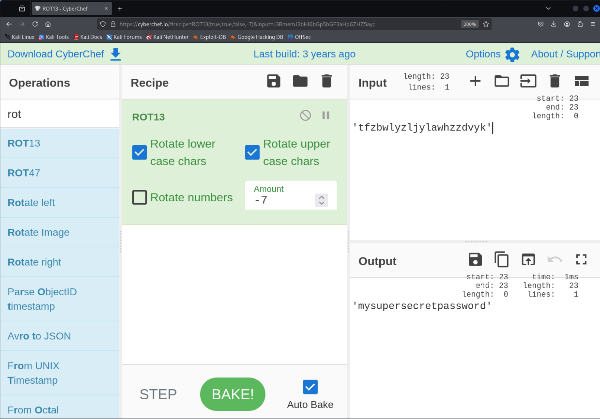
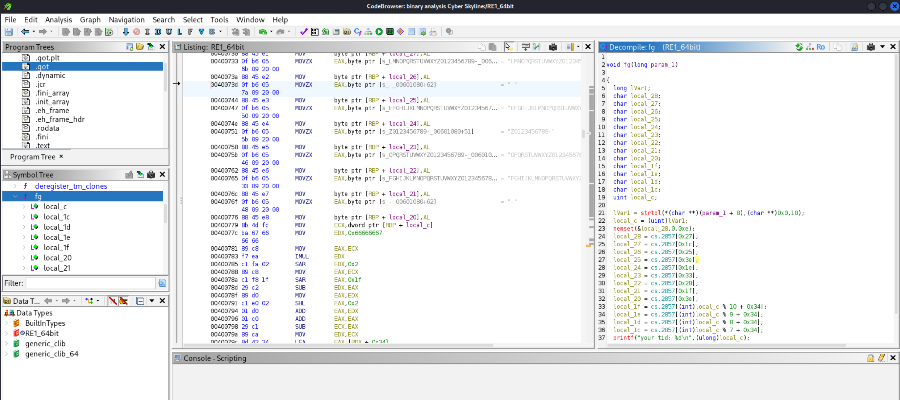

# **Enumeration & Exploitation**

### Challenges
- Python 1 (easy) n/i
- [**Python 2 (easy)**](#python-2)
- [**Python 3 (medium)**](#python-3)
- [**Binary 1 (medium)**](#binary-1)
- [**Binary 2 (hard)**](#binary-2)
- Timebomb (easy) n/i
- Bytes (easy) n/i

### Main Tools  
The main tools used in these challenges:
- **uncompyle** (Python 2, Python 3)
- **CyberChef** (Python 2)
- **gdb** (Binary 1, Binary 2)
- **Ghidra** (Binary 1, Binary 2)

### Python 2  
Given a compiled Python script, find a password to authenticate the program.  

#### Tools used
- **uncompyle6**
- **CyberChef**

#### Process  

- Download `PYTHON2.pyc` 
- Run **uncompyle6** (up to Python 3.12)
- The uncompiled script is here:  

<figure style="text-align:center">
  
  <figcaption style="font: italic small sans-serif">Use uncompyle6 on `PYTHON2.pyc`</figcaption>
</figure>  

- Use **CyberChef** with `ROT13`, and manually set "Amount" to `-7`:  

<figure style="text-align:center">
  
  <figcaption style="font: italic small sans-serif">Use CyberChef to shift password</figcaption>
</figure>  

> What is the password?
>
> **`mysupersecretpassword`**
{: .prompt-tip }

[Back to top](#challenges)

### Python 3  
Given a compiled Python script, find a password to authenticate the program.  

#### Tools used
- **uncompyle6**

#### Process  

- Download `PYTHON3.pyc` 
- Run **uncompyle6** (up to Python 3.12)
- The uncompiled script is here:  

<figure style="text-align:center">
  
  <figcaption style="font: italic small sans-serif">Use uncompyle6 on `PYTHON3.pyc`</figcaption>
</figure>  

- Solve for password --> See Notes a.-f. in the image above. Analyzing the function, the length of the password is 11 characters and the first character is `ord(password[0]) == 78`, or the first character is `chr(78) == "N"`. Solving for the variable, `builder` must equal 698 total. Therefor after the first character, the remaining ten characters must sum to 698 less 78 = 620. Ten `>` chars = 620 but this is not accepted. Four `0` = 4 * 48, five `G` = 5 * 71, and one `I` = 1 * 73 = 620.

> What is the password?
>
> **`N0000GGGGGI`**
{: .prompt-tip }

[Back to top](#challenges)

### Binary 1  
From Cyber Skyline: *We need to break into a program that hackers have created. You will need to provide the identifier, `7074`, as the only argument to the program.*  

#### Tools used
- **gdb**
- **Ghidra**

#### Process  
We need to use a disassembler program to access the compiled binary. Compiled binaries are machine code instructions represented in assembly language.
- Download `RE1_64bit` 
- First pass: 
  - Run **gdb**: `gbd RE1_64bit`, then at (gdb) prompt: `disassemble main`
  - From the Cyber Skyline literature, note that there is a call to `gets`, a known source of buffer overflow issues.
- Second pass:
  - Run **ghidra**: go to installed directory, e.g. `cd ghidra_11.3.1_PUBLIC`, then run `./ghidraRun`

<figure style="text-align:center">
  
  <figcaption style="font: italic small sans-serif">Run ghidra</figcaption>
</figure>  

  - Open `RE1_64bit` in **ghidra** and select analyze. The result is a decompiled source code written in C. Check out the primary function, which is `main()`.
  - In `main()`, Line 21 is asking for a password input. If the variable `local_c` is zero, the password fails, otherwise the function `fg()` runs with parameter `arg_v`- that is, if the password is correct, `fg()` runs. 

<figure>
  
  <figcaption style="font: italic small sans-serif; text-align:center">Source code with main()</figcaption>
</figure> 

  - Here we should keep in mind that we are given the 'identifier' `7074`- what does this refer to? 
  - We need to review `fg()`. We can tell that the variables `local_1c` through `local_28` are all `char` and amount to 13 total characters, which also is the length of the flag. We also know that a flag typically has the `-` character at positions 3 (`local25`) and 8 (`local20`), e.g. "xxx-xxxx-xxxx". 

<figure>
  
  <figcaption style="font: italic small sans-serif; text-align:center">"Source code with fg()</figcaption>
</figure> 

  - The value of these two characters match, i.e.`cs.2857[0x3e]`. This does not match an ASCII table directly- so this is not it. But if you highlight `local_25` and `local_20` separately, the first character in the string shown is `-`. 

<figure style="text-align:center">
  
  <figcaption style="font: italic small sans-serif; text-align:center">Value of `local_20`</figcaption>
</figure>  

  - Following this logic, the first 9 characters are: `NCL-EZOF` and then four additional characters converted into `int`s.
  - If `local_c == 7074`, then the next for numbers are `local_c` %10,9,8,7 = `c%10 == 4`,`c%9 == 0`, `c%8 == 2` and `c%7 == 4` or `4024`. 
  - Together:

 

> What is the flag hidden in the program?
>
> **`NCL-EZOF-4024`**
{: .prompt-tip }

[Back to top](#challenges)

### Binary 2  
From Cyber Skyline: *We need to break into a program that hackers have created. You will need to provide the identifier, `4930`, as the only argument to the program.*  

#### Tools used
- **gdb**
- **Ghidra**

#### Process  
We need to use a disassembler program to access the compiled binary. Compiled binaries are machine code instructions represented in assembly language.
- Download `RE2_64bit` 
- First pass: 
  - Run **gdb**: `gbd RE2_64bit`, then at (gdb) prompt: `info functions` (suggested by hints)

<figure>
  
  <figcaption style="font: italic small sans-serif; text-align:center">Run `info functions` in gdb</figcaption>
</figure>  

  - Note the function `getflagbyid`.
  - Also suggested by hints, run `break main` then `r`, then `call (void) getflagbyid(4930)`
  - Ultimately, no "(debugging) symbol table" found.
  - There might be a way around this, but for now need to abandon this approach.
- Second pass:
  - Run **ghidra**: go to installed directory, e.g. `cd ghidra_11.3.1_PUBLIC`, then run `./ghidraRun`
  - Open `RE2_64bit` in **ghidra** and select analyze. The result is a decompiled source code written in C. Check out the primary function, which is `main()`.
  - [!Note that a "Symbol Tree" is shown by **ghidra**...]
  - We can also review `getflagbyid()`. Similar to [**Binary 1**](#binary-1), there are 9 chars shown, with characters 3 and 8 again the same, and again this corresponds to `-` as seen below. There is also a stack of 4 chars, and together this matches the signature of the `NCL` flag.

<figure>
  
  <figcaption style="font: italic small sans-serif; text-align:center">Value of `local_15` in getflagbytid()</figcaption>
</figure>  

  - Following this logic, the first 9 characters are: `NCL-FYOF` and then four additional characters converted into `int`s.
  - The last four characters are shown below. 
    - Given `identifier/id == 4930`,
      - 1st: `(id + 0x8c = 140)%10 = 0`
      - 2nd: `(id + (-0x1450 = -5200))%9 = 0`
      - 3rd: `((id * 10) + (-0x78 = 120))%8 = 4`
      - 2nd: `(id + (0x23f0 = 9200))%7 = 4`  
    - Thus, the last four characters are `0044`

<figure>
  
  <figcaption style="font: italic small sans-serif; text-align:center">Last four chars in getflagbytid()</figcaption>
</figure> 

  - Together:  

> What is the flag hidden in the program?
>
> **`NCL-FYOF-0044`**
{: .prompt-tip }

[Back to top](#challenges)