{: width="972" height="589" }

# **Diskrupt**

### THM Walkthrough
Forensic Investigation of a Disk Image
### Main Tools  
The main tools used in this room:
- **HxD**
- **FTK Imager**
- **MFTExplorer**
- **CyberChef**

### Background
The [TryHackMe Diskrupt](https://tryhackme.com/room/diskrupt) challenge involves a forensic investigation of a disk image. The scenario presented is that an employee is suspected of exfiltrating proprietary info and attempting to erase traces of their actions. The forensics team has taken an image of the suspect’s disk, but due to an unexpected system failure, fragments of critical evidence were left behind on the workstation and external devices.  

The forensics lab has provided a forensic image of the hard drive. The expectations are to:
- Fix the damaged disk
- Examine the partitions
- Find evidence of access to sensitive documents
- Determine if any files were deleted or tampered with
- Discover all hidden files on the disk
- Carve out important files deleted from the disk

### Steps Taken  
- **FTK Imager**: Perform an initial inspection by opening the provided forensic image `challenge.001` using **FTK Imager**. When first opened, we are presented with an “Unrecognized file system”. The data structure of the disk image appears to match an MBR, however, the two bytes at the end of the 512 KB block (i.e. the magic number) are `0xACBD` - not `0x55AA` as expected.  

<figure style="text-align:center">
  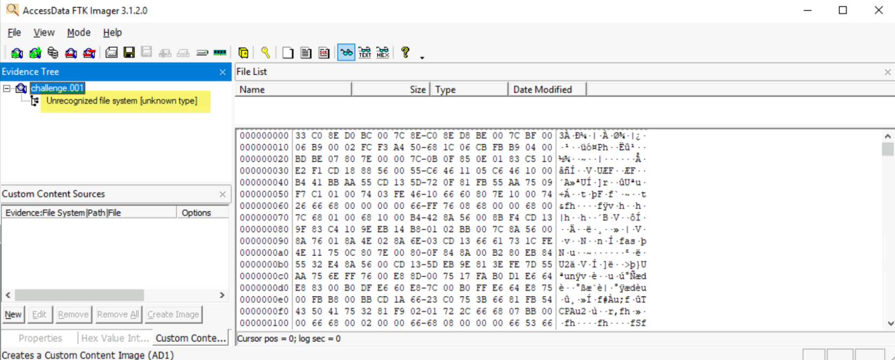
  <figcaption style="font: italic small sans-serif">Initial file inspection in FTK</figcaption>
</figure>

> Question: What are the corrupted bytes in the boot sector that caused the disk to be damaged?  
>
> Answer: `AC BD`
{: .prompt-tip }

<figure style="text-align:center">
  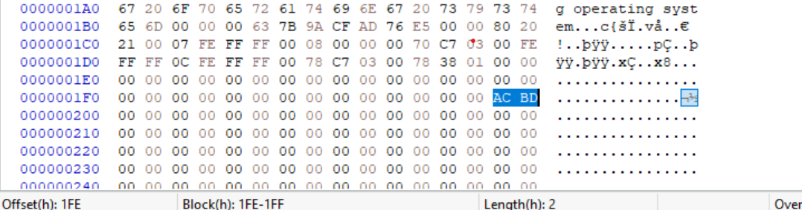
  <figcaption style="font: italic small sans-serif">Corrupted bytes</figcaption>
</figure>

- **HxD**: Next, we want to repair the image by changing the corrupted bytes. To do this, we will open the image in **HxD** so that we can change the signature to `55 AA`, which will make the code block recognizable as MBR.  
  - Edit `0xACBD` to MBR’s magic number `0x55AA` (highlighted in blue on image below).  
  - Next, review the 16 byte entries for each partition. In the image below, Partition 1 is highlighted in orange and Partition 2 in red. The byte in position 4 (of 0-15) identifies each Partition's file system. Partition 1’s file system is ID’d as NTFS (`07`), and Partition 2 is ID’d as FAT32 (`0C`). The bytes in position 12-15 are the number of sectors for the partition. 

<figure style="text-align:center">
  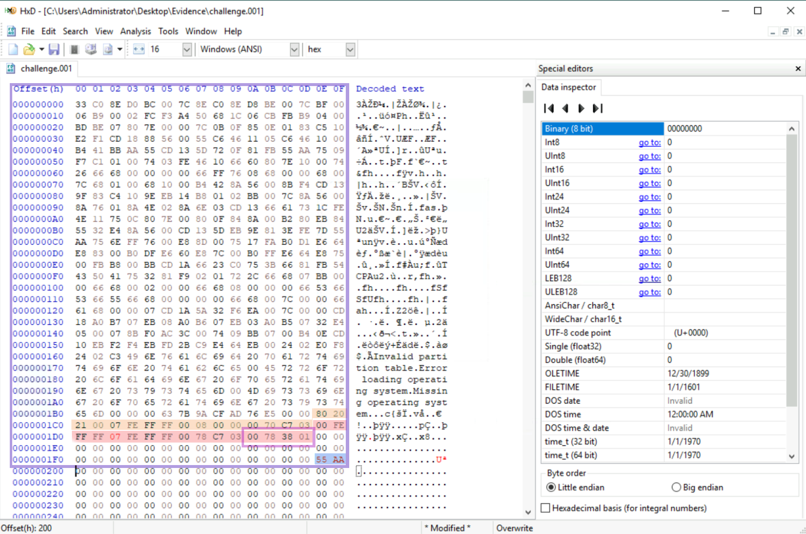
  <figcaption style="font: italic small sans-serif">Reviewing partition data for MBR</figcaption>
</figure>

> Question: What are the bytes representing the total sector of Partition 2 in little-endian?  
>
> Find the last four bytes of Partition 2 (in the purple box in the image above) and convert these to little-endian. The bytes are: `00 78 38 01` and converted to little-endian:  
>
> Answer: `0x01387800`
{: .prompt-tip }

> Question: What is the size in GB of Partition 1?  
>
> Highlight the last four bytes of Partition 1, then refer to the “Data inspector- Int32” = `63401984`. This is the number of sectors given to Partition 1. Multiply this number by 512 bytes/Sector, then divide by 1024**3 bytes/GB to get:
>
> Answer: `30.23 GB`
{: .prompt-tip }

<figure style="text-align:center">
  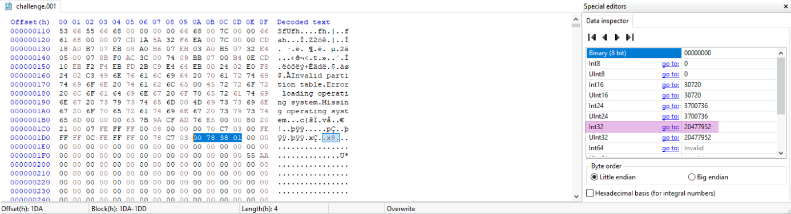
  <figcaption style="font: italic small sans-serif">Determining no. sectors for Partition 2</figcaption>
</figure>

> Question: What is the size in GB of Partition 2?  
>
> Similar to the previous question, highlight the last four bytes of Partition 2, then refer to the “Data inspector- Int32” = `20477952`. Multiply this number by 512 bytes/Sector, then divide by 1024**3 bytes/GB to get: 
>
> Answer: `9.76 GB`
{: .prompt-tip }

- **FTK Imager**: Re-open the newly edited `challenge.001`. The image is now recognized.
  - Got to the "Evidence Tree" on the left, then open Partition 1 --> NONAME (NFTS) --> [root]. On the right, highlight and download `$MFT` from the "File List".
  - Similarly, repeat for Partition 1 --> NONAME (NFTS) --> [root] --> $Extend --> $RmMetaData and find and download `$J`.

<figure style="text-align:center">
  
  <figcaption style="font: italic small sans-serif">Locate `$MFT` in 'Evidence Tree' and export file</figcaption>
</figure>

- **MFTECmd.exe**: From the command line prompt, analyze the file using **MFTE** which creates a CSV file:

<figure style="text-align:center">
  
  <figcaption style="font: italic small sans-serif">Analyze `$MFT` with MFTECmd.exe</figcaption>
</figure>

- **Timeline Explorer**: When complete, open both CSV files using native **Timeline Explorer**.  

> Question: In the NFTS partition, when was the text file related to the password created on the system?  
>
> Search for "passwords" in the `MFT_record.csv` file using Timeline Explorer. Select `passwords.txt` and locate the column “Update Timestamp”:
>
> Answer:`2025-03-19 22:01:57`  
{: .prompt-tip }

> Question: What is the full name of the sensitive PDF document accessed on this disk?  
>
> Search for ".pdf" in the `J_record.csv` file. Notice there is a 'sensitive' PDF:
>
> Answer:`Quantum-Resistant Cryptographic Algorithms.pdf`  
{: .prompt-tip }

> Question: When was this file first found on the disk?  
>
> The answer is given in the "Update Timestamp" column:
>
> Answer:`2025-03-20 00:44:37`  
{: .prompt-tip }

<figure style="text-align:center">
  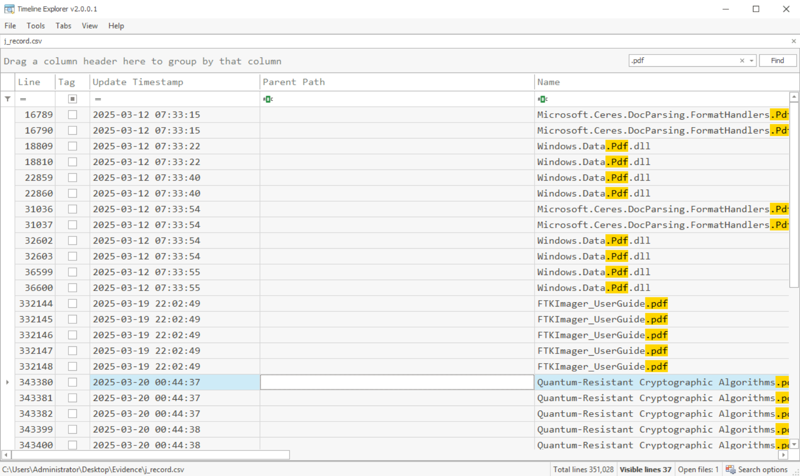
  <figcaption style="font: italic small sans-serif">Search CVS for '.pdf'</figcaption>
</figure>

> Question: What is the entry number of the directory in the Journal that was created and then deleted for exfiltration purposes on the disk?
>
> Search the `J_record.csv` for the term `exfil`. The "Name" `data exfil` appears in the search results. In the column "Entry Number":
>
> Answer: `163896` .
{: .prompt-tip }

<figure style="text-align:center">
  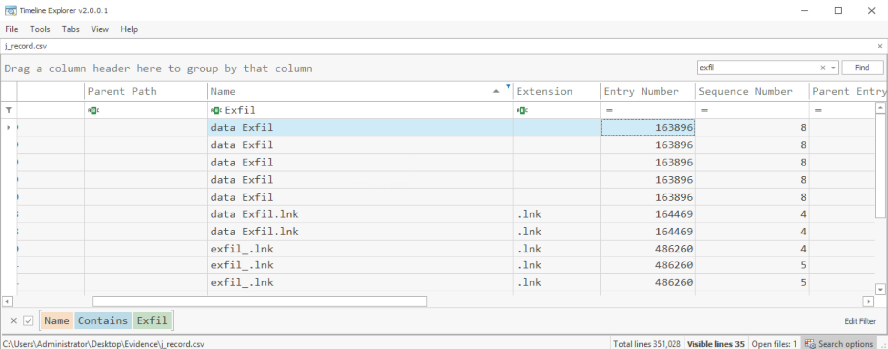
  <figcaption style="font: italic small sans-serif">Search CVS for 'exfil'</figcaption>
</figure>

> Question: What is the starting offset of the first zip file found after the offset `4E7B00000`.  
>
> In `FTK Imager`, select and "Go to" offset `4E7B00000`. Now we will need to search for the  magic numbers associated with ZIP files. These can be found at this reference from Gary Kessler. Search for this pattern: `50 4B 03 04`. The starting offset of the ZIP file is:
>
> Answer: `4E7B0E000`  
{: .prompt-tip }

<figure style="text-align:center">
  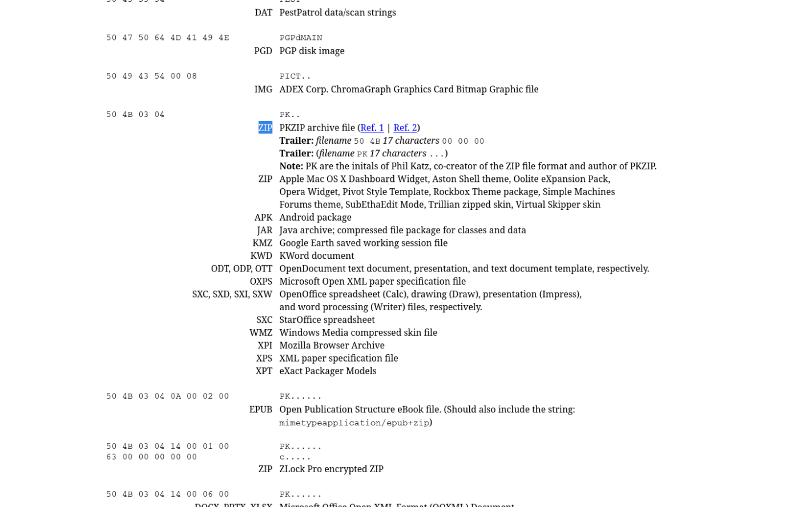
  <figcaption style="font: italic small sans-serif">Magic numbers for ZIP</figcaption>
</figure>

<figure style="text-align:center">
  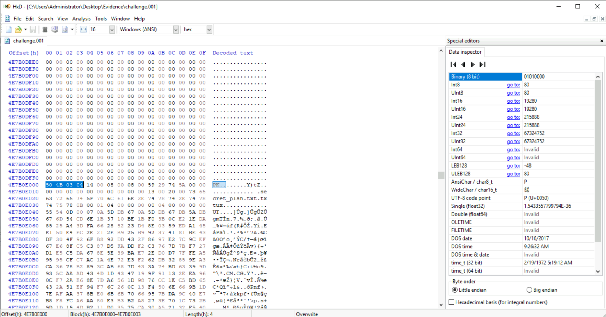
  <figcaption style="font: italic small sans-serif">Start of ZIP</figcaption>
</figure>

> Question: What is the ending offset of the zip file?  
>
> From the same reference above, we can search for `50 4B 05 06`. The ending offset is 18 bytes from the end:
>
> Answer: `4E7B0E43D`  
{: .prompt-tip }

<figure style="text-align:center">
  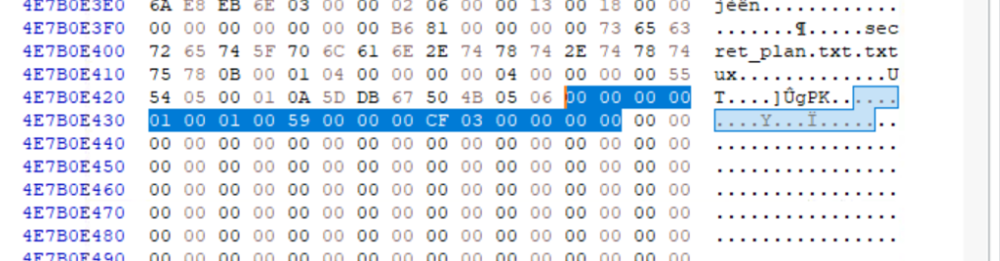
  <figcaption style="font: italic small sans-serif">Ending of ZIP</figcaption>
</figure>

> Question: What is the flag hidden within the file inside the zip file?
>
> To answer this question, select all bytes from the start to the end of the ZIP file, and copy to **CyberChef**. Select the option "From Hex", then save the file. The answer can be found by previewing the ZIP file:
>
> Answer: `FLAG:{RECOVERED_SECRET_THM}`
{: .prompt-tip }

<figure style="text-align:center">
  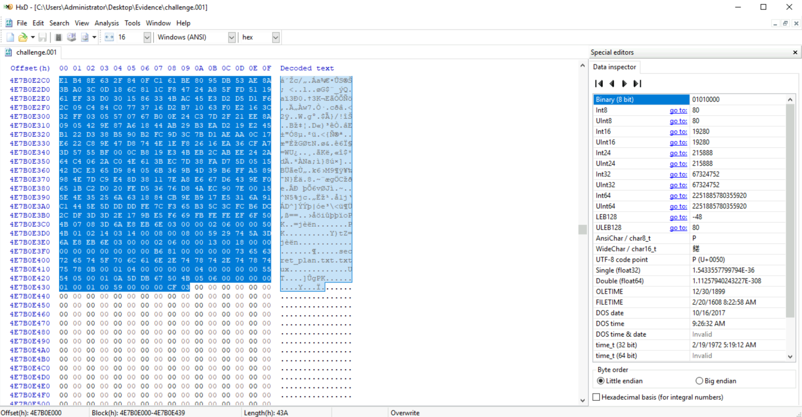
  <figcaption style="font: italic small sans-serif">Select all ZIP bytes</figcaption>
</figure>

<figure style="text-align:center">
  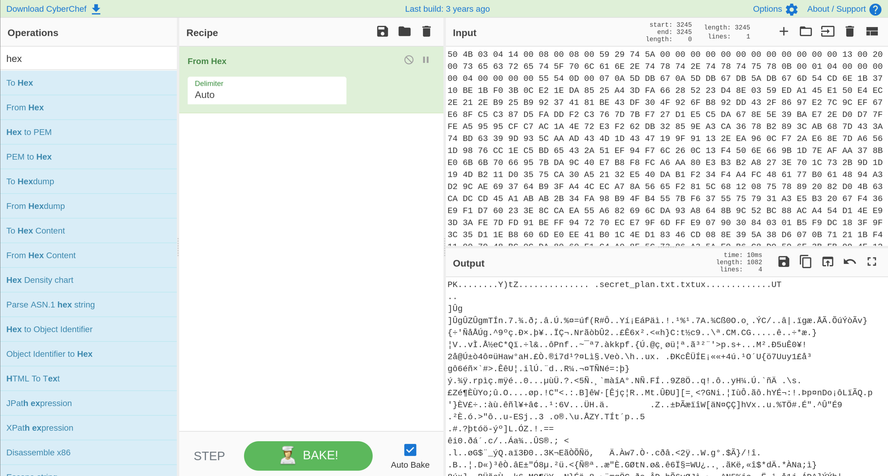
  <figcaption style="font: italic small sans-serif">Send to CyberChef</figcaption>
</figure>

<figure style="text-align:center">
  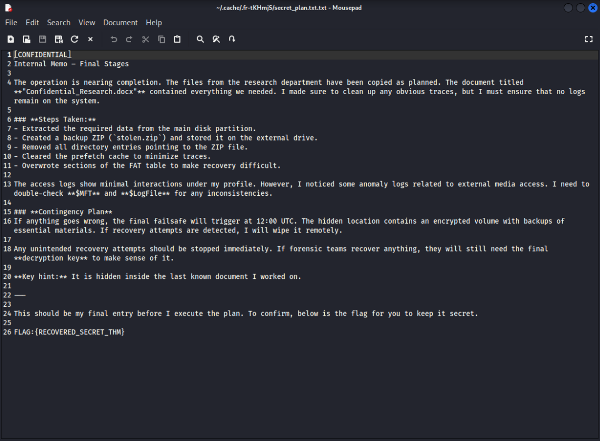
  <figcaption style="font: italic small sans-serif">Open Zip</figcaption>
</figure>

> Question: In the FAT32 partition, a tool related to the disk wiping was installed and then deleted. Can you find the name of that executable??
>
> The FAT32 partition is Partition 2. We can open Partition 2 in **FTK Imager** and review the "File list" of the "[root] directory, where the disk wipe utility is clearly listed: 
>
> Answer: `DiskWipe.exe`
{: .prompt-tip }

<figure style="text-align:center">
  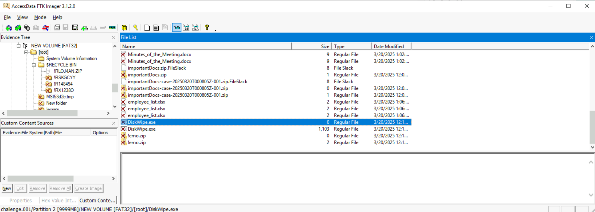
  <figcaption style="font: italic small sans-serif">Disk wiping tool</figcaption>
</figure>