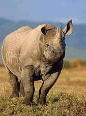

# **The Great Rhino Hunt of New Orleans**

### Cybersecurity - Forensics Project Report
Forensic investigation of a disk image and three network traces
### Main Tools 
The main tools used in this project:
- **Wireshark**
- **Autopsy**
- **FTK Imager**
- **JPSH for Windows r0.5**
- **John the Ripper**

### Background
*From [Rhino Hunt archives at NIST](https://cfreds-archive.nist.gov/dfrws/Rhino_Hunt.html) (Links to an external site.)* 
>#### Scenario
>"The city of New Orleans passed a law in 2004 making possession of nine or more unique rhinoceros images a serious crime. The network administrator at the University of New Orleans recently alerted police when his instance of RHINOVORE flagged illegal rhino traffic. Evidence in the case includes a computer and USB key seized from one of the University’s labs. Unfortunately, the computer had no hard drive. The USB key was imaged and a copy of the dd image is on the CD-ROM you’ve been given.  
>
>In addition to the USB key drive image, three network traces are also available—these were provided by the network administrator and involve the machine with the missing hard drive. The suspect is the primary user of this machine, who has been pursuing his Ph.D. at the University since 1972."
>
>#### MD5 Hashes for evidence
>c0d0093eb1664cd7b73f3a5225ae3f30 *rhino.log  
>cd21eaf4acfb50f71ffff857d7968341 *rhino2.log  
>7e29f9d67346df25faaf18efcd95fc30 *rhino3.log  
>80348c58eec4c328ef1f7709adc56a54 *RHINOUSB.dd  
>The image and trace files are in a [zip archive](https://cfreds.nist.gov/all/NIST/RhinoHunt) (Links to an external site.)
>
>#### The Task
>Recover at least nine rhino pictures from the available evidence and include them in a brief report.  In your report, provide answers to as many of the following questions as possible:
>
>* Who gave the accused a telnet/ftp account?
* What’s the username/password for the account?
* What relevant file transfers appear in the network traces?
* What happened to the hard drive in the computer?  Where is it now?
* What happened to the USB key?
* What is recoverable from the dd image of the USB key?
* Is there any evidence that connects the USB key and the network traces?  If so, what?

### Report

<figure style="text-align:center">
  
  <figcaption style="font: italic small sans-serif">Final digital forensics report</figcaption>
</figure>

### Responses
Recover at least nine rhino pictures from the available evidence and include them in a brief
report. In your report, provide answers to as many of the following questions as possible:  

> &nbsp;1. Who gave the accused a telnet/ftp account?  
>
> &nbsp;**Jeremy set up the account according to the diary/journal (see entries at 4 & 5):** *“I need to change the password on the gnome account that Jeremy gave me. I can probably just do that at Radio Shack.”*
{: .prompt-tip }

> &nbsp;2. What’s the username/password for the account?
>
> &nbsp;**gnome / gnome123**i
{: .prompt-tip }

> &nbsp;3. What relevant file transfers appear in the network traces?
>
> &nbsp;**Refer to endnotes below: two images plus one zip file in FTP transfer in `rhino.log`, two images and one HTML in HTTP transfer in `rhino2.log`, and `rhino.exe` in `rhino3.log`**
{: .prompt-tip }

> &nbsp;4. What happened to the hard drive in the computer? Where is it now?
>
> &nbsp;**According to the diary/journal**ii, *“I zapped the hard drive and then threw it into the Mississippi River.”*
{: .prompt-tip }

> &nbsp;5. What happened to the USB key?
>
> &nbsp;**According to the same diary/journal,** *“I’m gonna reformat my USB key after this entry, but try not to destroy the good stuff.”*
{: .prompt-tip }

> &nbsp;6. What is recoverable from the dd image of the USB key?
>
> &nbsp;**From the unallocated files, (7) jpg and (2) gif images, though not all are rhinos. Also, there is a diary/journal, recipes, and an html webpage.**
{: .prompt-tip }

> &nbsp;7. Is there any evidence that connects the USB key and the network traces? If so, what?
>
> &nbsp;**None found at time of report, though the same rhino photo was on the USB and on the network traces.**
{: .prompt-tip }

### Images recovered

  <figure style="text-align:right">
    
    
  </figure>  

<figure style="text-align:right">
  <figcaption style="font: italic small sans-serif">from `rhino.log` via Wireshark</figcaption>
  <figcaption style="font: sans-serif; font-weight: bold;">`rhino1.jpg` `rhino3.jpg`iii</figcaption>
</figure> 

<figure style="text-align:center">
  
  <figcaption style="text-align: right; font: italic small sans-serif">from `rhino.log` --> `contraband.zip` via Wireshark</figcaption>
  <figcaption style="text-align: right; font: sans-serif; font-weight: bold;">`rhino2.jpg`iv</figcaption>
</figure> 

  <figure style="text-align:right">
    
    
  </figure>  

<figure style="text-align:right">
  <figcaption style="font: italic small sans-serif">from `rhino2.log` via Wireshark</figcaption>
  <figcaption style="font: sans-serif; font-weight: bold;">`rhino4.jpg` `rhino5.gif`v</figcaption>
</figure> 

  <figure style="text-align:right">
    
    
  </figure>

  <figure style="text-align:right">
    
    
  </figure>  

<figure style="text-align:right">
  <figcaption style="font: italic small sans-serif">from `rhino2.log` via Wireshark</figcaption>
  <figcaption style="font: sans-serif; font-weight: bold;">`10-f0105848.jpg.jpg` dupe `11-f0105864.gif` `12-f0106320.png` `13-f0106344`vi</figcaption>
</figure> 

#### Steganography

  <figure style="text-align:right">
    
    
  </figure>

<figure style="text-align:right">
  <figcaption style="font: italic small sans-serif">extracted from source image `7-f0103704.jpg`using JPSH for Windows r0.5:</figcaption>
  <figcaption style="font: sans-serif; font-weight: bold;">`hiddenRhino1.jpg`</figcaption>
</figure> 

  <figure style="text-align:right">
    
    
  </figure>

<figure style="text-align:right">
  <figcaption style="font: italic small sans-serif">extracted from source image `8-f0105420`using JPSH for Windows r0.5:</figcaption>
  <figcaption style="font: sans-serif; font-weight: bold;">`hiddenRhino2.jpg`vii</figcaption>
</figure> 

### Endnotes

i: Analysis of `rhino.log` using **Wireshark v4.4.2**. Login/password Information was readable with filter `ftp` (top).  

<figure style="text-align:center">
  
  <figcaption style="font: italic small sans-serif"></figcaption>
</figure>  

ii: Diary recovered from analysis of `RHINOUSB.dd` using **FTK Imager v4.7.3.81** and extracting Unallocated Space `25604`. This file in turn analyzed using **Autopsy v4.21.0** and extracting text file:  

<figure style="text-align:center">
  
  <figcaption style="font: italic small sans-serif"></figcaption>
</figure> 

iii: `rhino.log` analyzed using **Wireshark v4.4.2** images `rhino1.jpg` and `rhino3.jpg` as well as file `contraband.zip` were readily apparent using an additional filter of `ftp-data` (bottom), then extracted using File → Export Objects → FTP-DATA.  

<figure style="text-align:center">
  
  <figcaption style="font: italic small sans-serif"></figcaption>
</figure> 

iv: Extracted the `contraband.zip` file using **John the Ripper v1.9.0**. First generated a password list using Python script (kept password length at 6 characters beginning with ‘m’ to keep computer from crashing), then converted the zip file using command `zip2john`, and finally using `john`.  

v: Similarly, `rhino2.log` analyzed using **Wireshark** with a filter of `http`, extracted using File → Export Objects → HTTP  

<figure style="text-align:center">
  
  <figcaption style="font: italic small sans-serif"></figcaption>
</figure> 

vi: Using **FTK Imager**, extracted the Unallocated Space file named `00004`, then opened this file with **Autopsy**. From **Autopsy**, (7) - .jpg files were extractable: four were of alligators (with one repeat), and two were of rhinos (with one repeat). Additionally, (2)- .gif images of rhinos were extractable.  

<figure style="text-align:center">
  
  <figcaption style="font: italic small sans-serif"></figcaption>
</figure>  

vii: Using **JPHS for Windows v0.5** extracted hidden images from steganographic images: First from `7-f0103704.jpg` using a *PROVIDED* password of `gator`, the second from `8-f0104520.jpg` using a *PROVIDED* password of `gumbo`

  <figure style="text-align:right">
    
    
  </figure>

