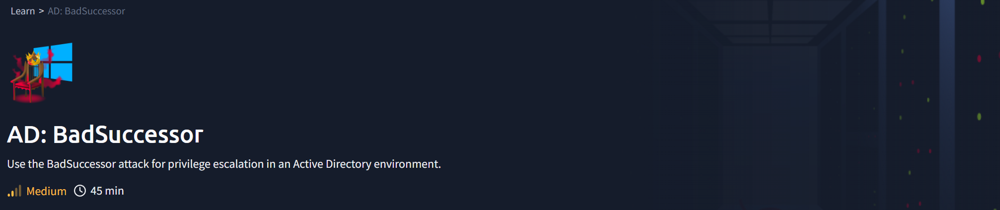
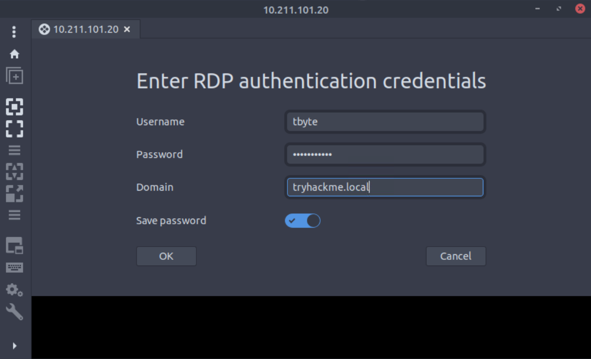
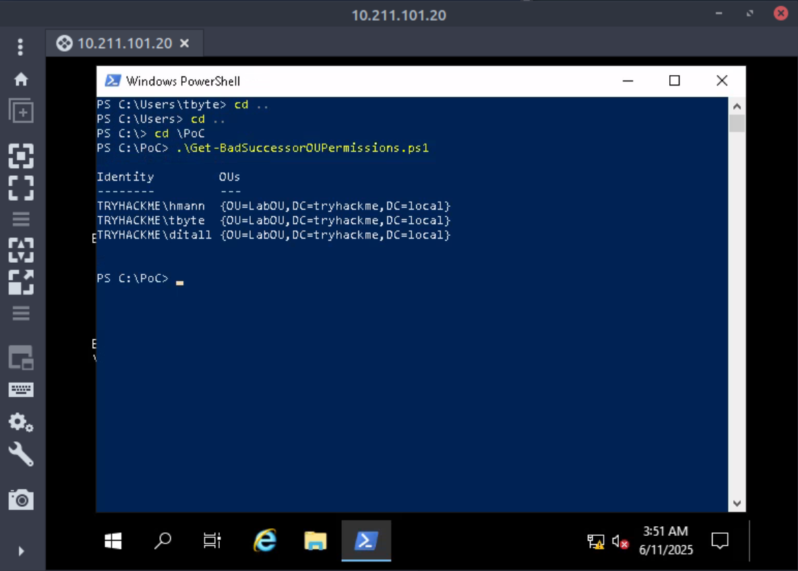
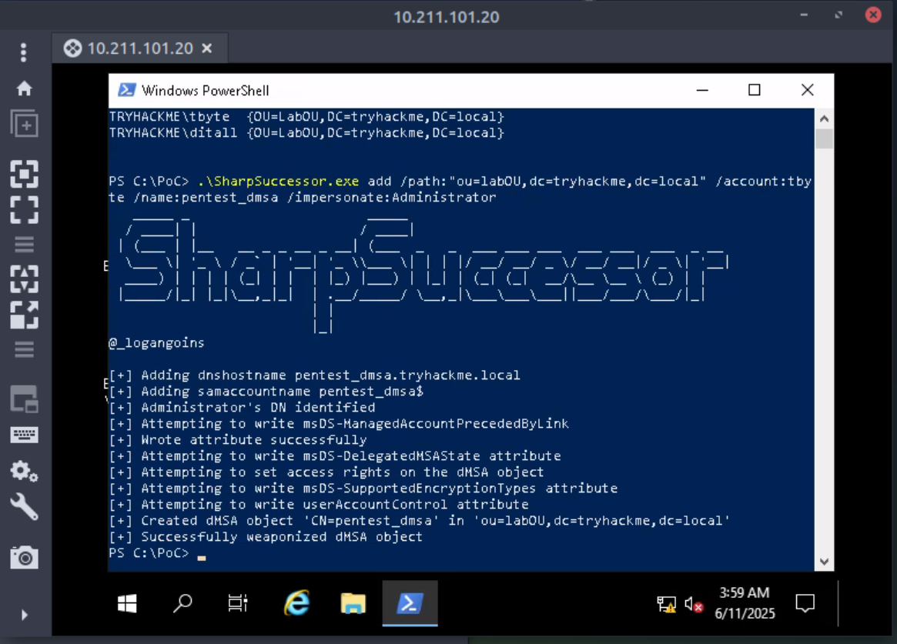
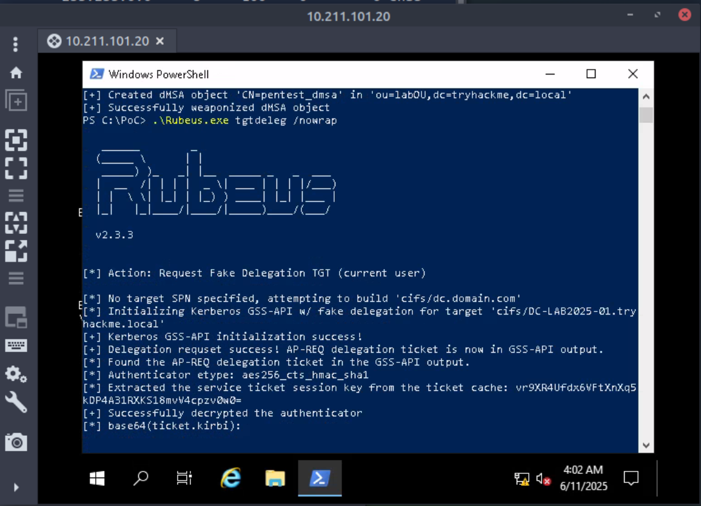
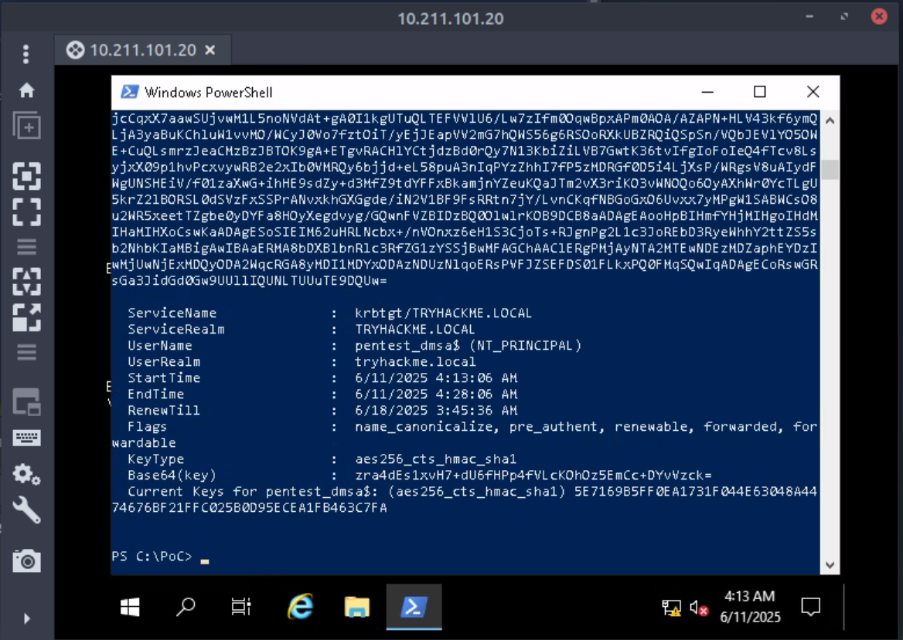
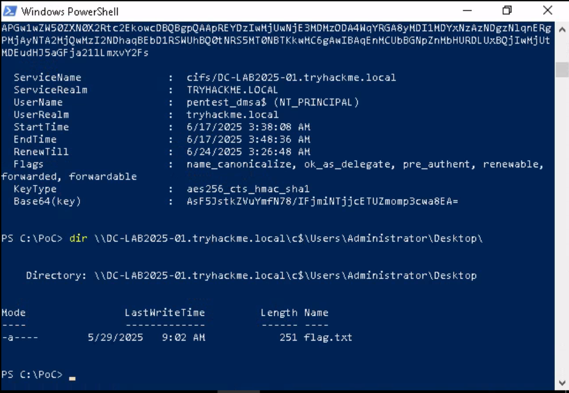
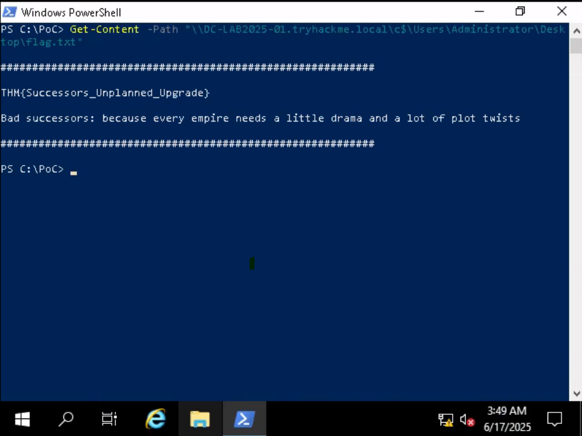

{: width="972" height="589" }

# **AD: BadSuccessor**

### THM Walkthrough
Privilege escalation in Active Directory using BadSuccessor
### Main Tools  
The main tools used in this room:
- **Remmina**
- **SharpSuccessor.exe**
- **Rubeus**
- **bloodyAD**
- **impacket**

### Background
The [TryHackMe AD BadSuccessor](https://tryhackme.com/room/adbadsuccessor) room covers a privilege escalation attack to a delegated Managed Service Account, allowing a user to gain admin access through the control of a dMSA object. 

A Manage Service Account (MSA) is a type of Active Directory (AD) account that allows for the running of services or schedule tasks in Windows, without the need for a human input of a passport. 
- A standalone MSA (sMSA) is designed for a service running on a single computer. AD handles the account password, including 30 day rotation by default. It was introduced in Windows Server 2008 R2.
- A group MSA (gMSA) is designed for a service running on multiple computers. Again, AD manages the account password. It was introduced in Windows Server 2012.
- A delegated MSA (dMSA) is managed by an admin and allows running a service on a specific server. It was introduced in Windows Server 2025.
The BadSuccessor attack can be carried out if the user controls a dMSA object: the attacker starts either by gaining control of an existing dMSA, or by managing to create a new dMSA. 

### Steps Taken  

- **Remmina**: We are provided with credentials for a Windows Server 2019 account which we can use to log in to RDP using **Remmina**. 

<figure>
  
  <figcaption style="font: italic small sans-serif; text-align:center">Logging in using Remmina</figcaption>
</figure>

- We are provided with a powershell script `Get-BadSuccessorOUPermissions.ps1` that will help us identify accounts that can create dMSAs in their Organization Units. 

<figure>
  
  <figcaption style="font: italic small sans-serif; text-align:center">Using the Powershell script</figcaption>
</figure>

> Question: What is the username of the third account?  
>
> Answer: `ditall`
{: .prompt-tip }
- The next step of the attack is to create a new dMSA in an OU where the user account has write access, and then modifying the object to mimic a successful migration. 
- **SharpSuccessor**: We are provided a program written in C# that will help us with the attack. Given a `/path:` the user has access to, the `/account:` with access to the OU, the `/name:` for the dMSA object to create, and the account to `/impersonate:`, we can create a weaponized dMSA object.

<figure>
  
  <figcaption style="font: italic small sans-serif; text-align:center">Weaponized dMSA</figcaption>
</figure>

- **Rubeus**: Next, we can use **Rubeus** to request a Ticket Granting Ticket (TGT). "`tgtdeleg` *abuses a lesser-known feature of Kerberos’s unconstrained delegation. It asks the system to impersonate the current user and export their TGT directly from memory via a legitimate API call. On the other hand, the* `/nowrap` *option outputs the result (typically base64) in a single line, perfect for copy-paste reuse without formatting headaches."*

<figure>
  
</figure>
<figure>
  
  <figcaption style="font: italic small sans-serif; text-align:center">Creating a TGT</figcaption>
</figure>

- With the just-generated ticket (TGT), we impersonate the dMSA and make a request to the Ticket Granting Service (TGS). The Server Principal Name (SPN) we are targeting is the Kerberos Ticket Granting Account. 
- The command is  
`.\Rubeus.exe asktgs /targetuser:pentest_dmsa$ /service:krbtgt/tryhackme.local /opsec /dmsa /nowrap /ptt /ticket:doIFvjC...`  

  with the options as follows:
    - `/opsec` to tell **Rubeus** to disable ticket reuse and RC4 encryption, and ensure more EDR-friendly usage,
  - `/dmsa` for the dMSA context, and
  - `/ptt` for pass-the-ticket behavior.
- With this new ticket, we request a service ticket with Administrator access. 
- The command is:  
`.\Rubeus.exe asktgs /user:pentest_dmsa$ /service:cifs/DC-LAB2025-01.tryhackme.local /opsec /dmsa /nowrap /ptt /ticket:doIGLjCCB..`  
  which includes:
  - `/user:` the user we are impersonating, and 
  - `/service:` the SPN for SMB/CIFS service we are accessing.
  
<figure>
  
  <figcaption style="font: italic small sans-serif; text-align:center">Accessing the Admin Account</figcaption>
</figure>
<figure>
  
  <figcaption style="font: italic small sans-serif; text-align:center">Accessing the Flag</figcaption>
</figure>

> Question: What is the flag on the Administrator’s Desktop?  
>
> Answer: `THM{Successors_Unplanned_Upgrade}`
{: .prompt-tip }

The remainder of this room repeats the same exploitation using Kali and the **bloodyAD** and **Impacket** tools. 

