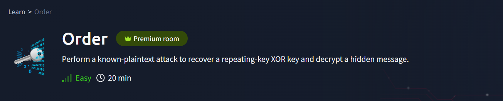
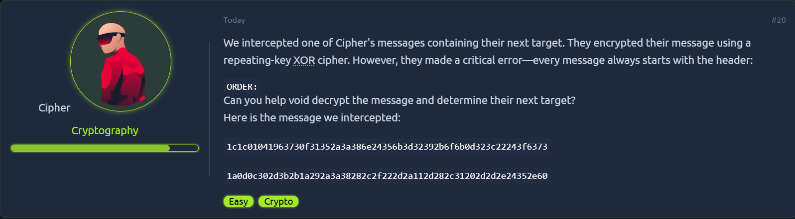
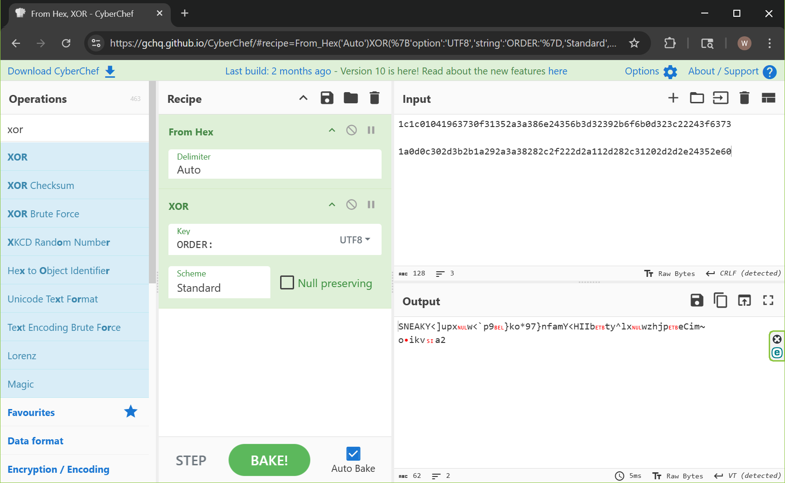
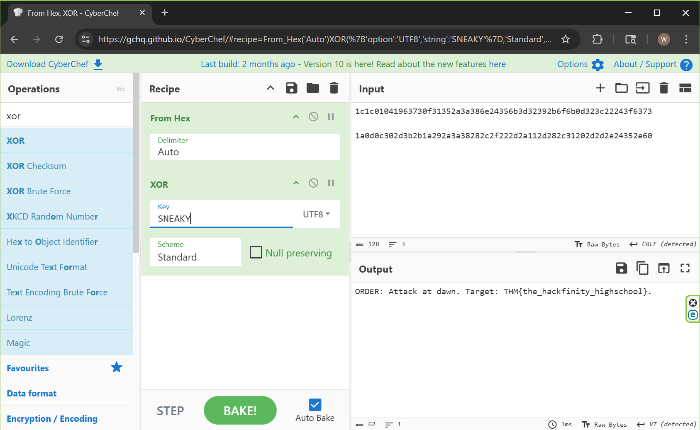

{: width="972" height="589" }

# **Order**

### THM Walkthrough
Decryption of an XOR cipher
### Main Tools  
The main tools used in this room:
- **CyberChef**

### Background
The [TryHackMe Order](https://tryhackme.com/room/order) room contains a simple objective. We are provided with a repeating-key XOR cipher, and we know that the message starts with a specific header.

### Steps Taken  

- We are provided with the following information:

<figure>
  
  <figcaption style="font: italic small sans-serif; text-align:center">Initial description of XOR cipher</figcaption>
</figure>

- A simple XOR cipher is a type of additive cipher. The key thing to know is that given the message transformed using XOR with a key results in the cipher, and conversely if we know the plaintext for a certain portion of the original messsage, we can use this to determine what the key is for the corresponding section.
- In this case, we are told that the cipher is using a repeating-key and that each message begins with the plaintext "ORDER:". 
- **CyberChef**: We can paste the cipher into **CyberChef**'s Input. The data appears to be in hexadecimal, therefore we should select "From Hex" as the first operation in the 'recipe'. For the next operation, we select "XOR" and enter "ORDER:" as the key, in "UTF8".
- After "BAKE!", we can see that at least the first six characters of the repeating key must be "SNEAKY". 

<figure style="text-align:center">
  
  <figcaption style="font: italic small sans-serif; text-align:center">Using CyberChef to decipher</figcaption>
</figure>

- We can then enter "SNEAKY" as the key in the "XOR" operation. Fortunately for us, this results in a full deciphering of the original message. 

<figure>
  
  <figcaption style="font: italic small sans-serif; text-align:center">Final message deciphered</figcaption>
</figure>

> Question: What is the flag?  
>
> Answer: `THM{the_hackfinity_highschool}`
{: .prompt-tip }